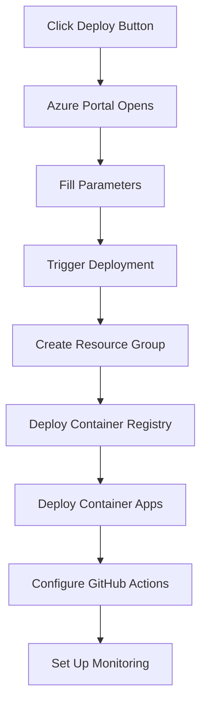

# One-Click Azure Deployment Guide

## Overview
This guide explains how we implemented the "Deploy to Azure" button functionality, which allows users to deploy our application to Azure with a single click. This approach combines several Azure and GitHub features to create a seamless deployment experience.

## How It Works

### 1. The Deploy Button
```markdown
[](https://portal.azure.com/#create/Microsoft.Template/uri/https%3A%2F%2Fraw.githubusercontent.com%2FYOUR_USERNAME%2FPROJECT_NAME%2Fmain%2Finfrastructure%2Fazuredeploy.json)
```

This button creates a direct link to the Azure Portal with our ARM (Azure Resource Manager) template pre-loaded. When clicked:
1. User is directed to Azure Portal
2. ARM template is loaded from our repository
3. User fills in parameters through a friendly UI
4. Azure creates all resources automatically

### 2. Key Components

#### A. Infrastructure as Code (IaC)
We use two approaches that work together:

1. **Bicep Template** (`main.bicep`)
   - Modern, more readable syntax
   - Easier to maintain
   - Compiled to ARM template
   - Used for local development

2. **ARM Template** (`azuredeploy.json`)
   - Generated from Bicep
   - Required for the Deploy button
   - JSON format that Azure understands
   - Contains all resource definitions

#### B. Parameter Files
- `azuredeploy.parameters.json`: Defines customizable values
- Makes the deployment configurable
- Shows up in Azure Portal UI

### 3. Resource Creation Flow



## Implementation Details

### 1. Resource Types Created
- Azure Container Registry (ACR)
- Container Apps Environment
- Frontend Container App
- Backend Container App
- Application Insights
- Managed Identity
- Log Analytics Workspace

### 2. Automation Features

#### A. GitHub Integration
```json
{
    "deployGitHubAction": {
        "type": "bool",
        "defaultValue": true,
        "metadata": {
            "description": "Create GitHub Action federated credentials"
        }
    }
}
```
- Automatically sets up GitHub Actions
- Creates necessary service principals
- Configures repository secrets

#### B. Environment Configuration
- Sets up production-ready defaults
- Configures scaling rules
- Establishes monitoring
- Sets up custom domains

### 3. Post-Deployment Configuration
The `configure-github.sh` script handles:
- Setting up GitHub secrets
- Configuring environment variables
- Setting up CI/CD pipeline

## Best Practices

### 1. Security
- Use managed identities where possible
- Implement least-privilege access
- Store secrets in Key Vault
- Use HTTPS for all endpoints

### 2. Scalability
- Configure auto-scaling rules
- Use consumption-based resources
- Implement proper health checks
- Monitor performance metrics

### 3. Maintainability
- Use infrastructure as code
- Implement proper tagging
- Document all parameters
- Version your templates

## Common Tasks

### How to Modify Resources
1. Edit the Bicep file (`main.bicep`)
2. Compile to ARM template:
   ```bash
   az bicep build --file main.bicep --outfile azuredeploy.json
   ```
3. Commit and push changes

### How to Test Templates
1. Validate template:
   ```bash
   az deployment group validate \
     --resource-group myRG \
     --template-file azuredeploy.json \
     --parameters @azuredeploy.parameters.json
   ```

### How to Update Deployed Resources
1. Update Bicep/ARM templates
2. Use incremental deployment:
   ```bash
   az deployment group create \
     --mode Incremental \
     --resource-group myRG \
     --template-file azuredeploy.json
   ```

## Troubleshooting

### Common Issues
1. **Resource Name Conflicts**
   - Use unique naming conventions
   - Implement proper prefixes/suffixes

2. **Permission Issues**
   - Check role assignments
   - Verify service principal permissions

3. **Deployment Failures**
   - Check activity logs
   - Verify resource quotas
   - Check template validation

### Validation Steps
1. Verify resource creation
2. Check application logs
3. Test endpoints
4. Verify GitHub Actions setup

## Learning Resources

### Azure Documentation
- [ARM Template Documentation](https://docs.microsoft.com/azure/azure-resource-manager/templates/)
- [Bicep Documentation](https://docs.microsoft.com/azure/azure-resource-manager/bicep/)
- [Container Apps Documentation](https://docs.microsoft.com/azure/container-apps/)

### Tools
- [Azure CLI](https://docs.microsoft.com/cli/azure/)
- [Bicep VSCode Extension](https://marketplace.visualstudio.com/items?itemName=ms-azuretools.vscode-bicep)
- [ARM Template Viewer](https://azure.microsoft.com/features/resource-visualizer/)