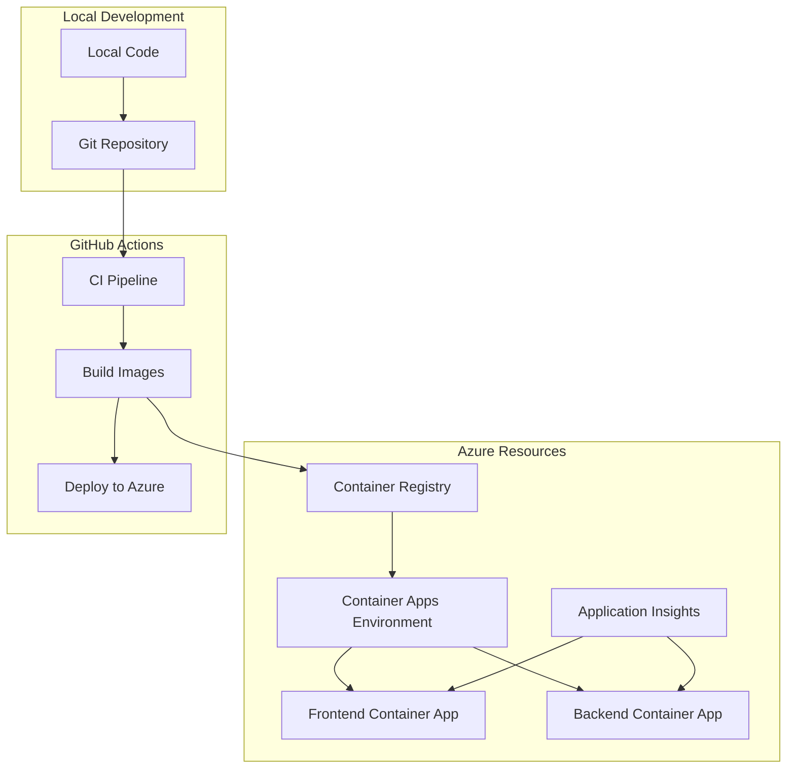
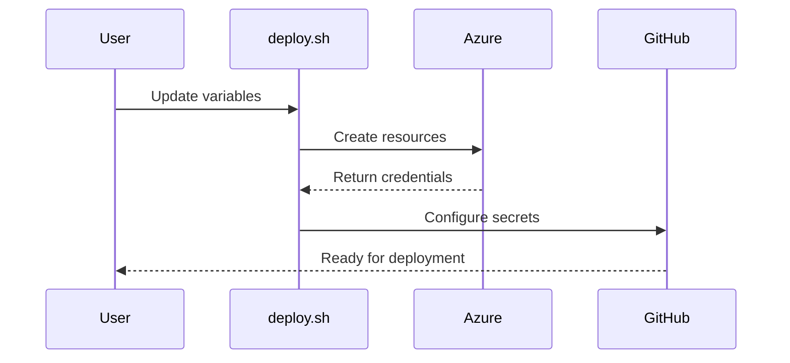
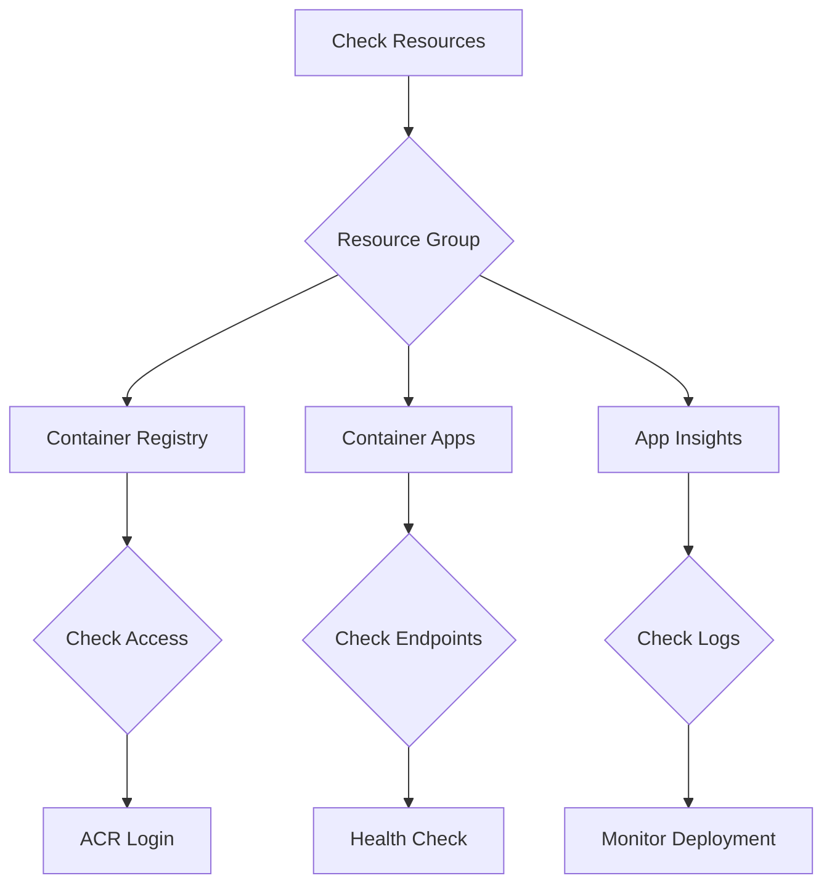
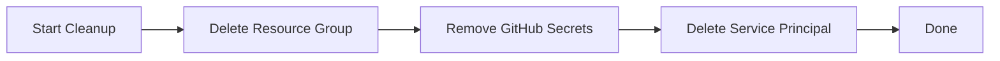

# Quick Start: Testing the Automated Deployment

## Architecture Overview



## Prerequisites
1. Azure CLI installed
2. GitHub account
3. Azure subscription
4. A domain name (optional, but recommended for testing)

## Test Deployment Steps

### 1. Fork & Clone
```bash
git clone https://github.com/YOUR_USERNAME/my-react-fastapi-app
cd my-react-fastapi-app
```

### 2. Update Configuration



Edit `infrastructure/deploy.sh`:
```bash
SUBSCRIPTION_NAME="your-subscription-name"
RESOURCE_GROUP="test-app-rg"
LOCATION="eastus"
ENVIRONMENT_NAME="test-env"
ACR_NAME="testreactfastapi"  # Must be globally unique
DOMAIN_NAME="your-domain.com"  # Optional
```

### 3. Deploy Infrastructure
```bash
# Login to Azure
az login

# Run deployment script
cd infrastructure
chmod +x deploy.sh
./deploy.sh
```

### 4. Verify Infrastructure



Check resources in Azure Portal:
1. Resource Group created
2. Container Registry accessible
3. Container Apps environment ready
4. Application Insights receiving data

### 5. Test Automated Deployment

1. Make a small change to the frontend:
   ```bash
   cd frontend/src
   # Edit App.tsx to change the title
   ```

2. Commit and push:
   ```bash
   git add .
   git commit -m "test: Update title for deployment test"
   git push origin main
   ```

3. Monitor deployment:
   - Watch GitHub Actions pipeline
   - Check Azure Container Apps revisions
   - Verify frontend changes at https://your-domain.com

## Common Issues & Solutions

### ACR Access Issues
```bash
# Verify ACR login
az acr login --name $ACR_NAME
```

### GitHub Actions Failed
1. Check secrets are correctly set
2. Verify service principal permissions
3. Check container build logs

### Container Apps Not Responding
```bash
# Check container app status
az containerapp show --name frontend --resource-group test-app-rg
az containerapp logs show --name frontend --resource-group test-app-rg
```

## Cleanup Test Deployment



```bash
# Delete all resources
az group delete --name test-app-rg --yes --no-wait

# List and delete service principal
az ad sp list --display-name "${ENVIRONMENT_NAME}-github-actions" --query "[].appId" -o tsv
az ad sp delete --id <app-id>
```

## Verify Production Readiness

### Health Check Endpoints
- Frontend: https://your-domain.com
- Backend API: https://api.your-domain.com/api/health
- API Docs: https://api.your-domain.com/api/docs

### Monitoring
1. Application Insights
   - Check request rates
   - Review any errors
   - Monitor response times

2. Container Apps
   - Check revision history
   - Monitor scale events
   - Review container logs