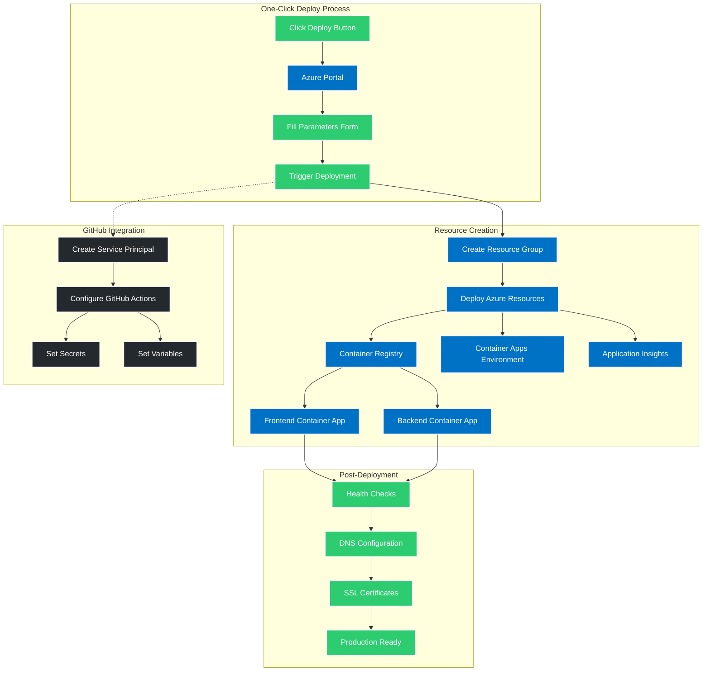

```mermaid
graph TD
    subgraph "One-Click Deploy Process"
        A[Click Deploy Button] --> B[Azure Portal]
        B --> C[Fill Parameters Form]
        C --> D[Trigger Deployment]
    end

    subgraph "Resource Creation"
        D --> E[Create Resource Group]
        E --> F[Deploy Azure Resources]
        F --> G1[Container Registry]
        F --> G2[Container Apps Environment]
        F --> G3[Application Insights]
        G1 --> H1[Frontend Container App]
        G1 --> H2[Backend Container App]
    end

    subgraph "GitHub Integration"
        D -.-> I[Create Service Principal]
        I --> J[Configure GitHub Actions]
        J --> K1[Set Secrets]
        J --> K2[Set Variables]
    end

    subgraph "Post-Deployment"
        H1 & H2 --> L[Health Checks]
        L --> M[DNS Configuration]
        M --> N[SSL Certificates]
        N --> O[Production Ready]
    end

classDef azure fill:#0072C6,stroke:#fff,stroke-width:2px,color:#fff
classDef github fill:#24292E,stroke:#fff,stroke-width:2px,color:#fff
classDef process fill:#2ECC71,stroke:#fff,stroke-width:2px,color:#fff

class B,E,F,G1,G2,G3,H1,H2 azure
class I,J,K1,K2 github
class A,C,D,L,M,N,O process
```